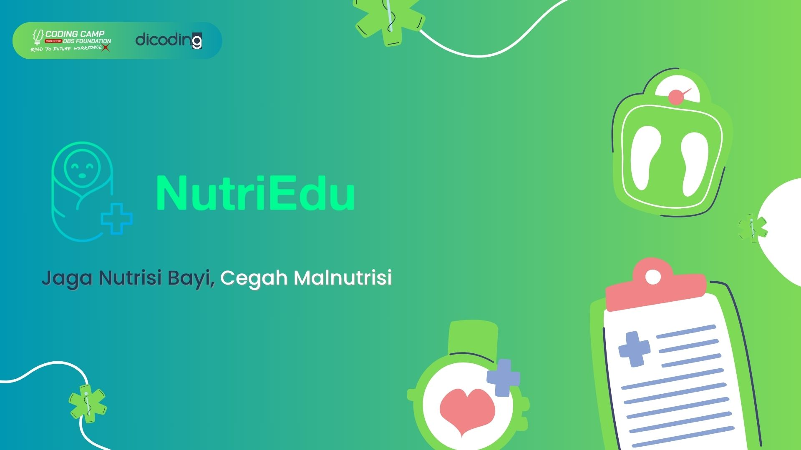
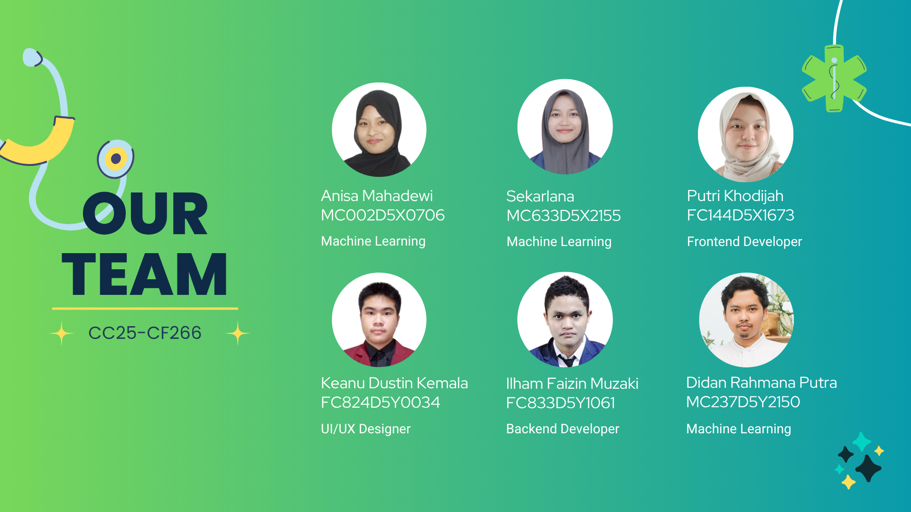

# DBS Foundation X Dicoding Capstone Project

Capstone project for DBS Fondation x Dicoding 2025

#### Team ID: CC25-CF266
#### Project Name: NutriEdu

#### Members

| Name | Student ID | Role | LinkedIn | Github |
| :------------------ | :------------- | :------------------ | :------------------ | :------------------ |
| `Anisa Mahadewi` | `MC002D5X0706` | `Machine Learning` | [Click Me]() | [Click Me]() |
| `Sekarlana` | `MC633D5X2155` | `Machine Learning` | [Click Me]() | [Click Me]() |
| `Putri Khodijah` | `FC144D5X1673` | `Front-End Developer` | [Click Me](https://www.linkedin.com/in/putri-khodijah-158156285/) | [Click Me](https://github.com/Putrikhodi) |
| `Keanu Dustin Kemala` | `FC824D5YOO34` | `UI/UX Designer & Front-End Web` | [Click Me](https://www.linkedin.com/in/keanu-dustin-kemala/) | [Click Me]() |
| `Ilham Faizin Muzaki` | `FC833D5Y1061` | `Backend Developer & Front-End Web` | [Click Me]() | [Click Me]() |
| `Didan Rahmana Putra` | `MC237D5Y2150` | `Machine Learning` | [Click Me]() | [Click Me]() |
